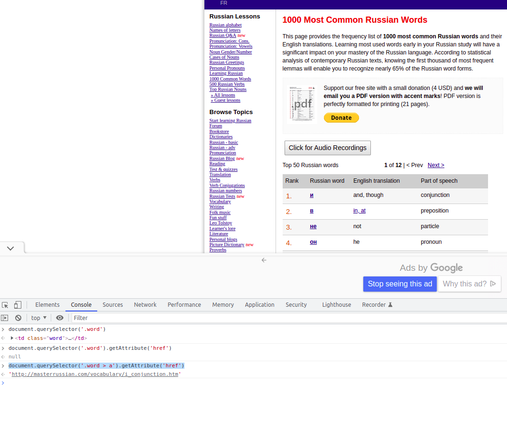

## Why?

For a while now I've been studying Russian.
There's a site called Master Russian which has a list of the 1000 words most commonly used in Russian.
For each of these words it has example phrases explaining how a word is used.
A lot of times the same word can be used in a variety of ways.

Take for example the most common word `и`.
In its most basic way it just means "and":

> Мальчик и девочка играют.
>
> A boy and a girl are playing

The same word can also mean "too":

> Она и нам рассказала.
>
> She told us too.

As you can see these example phrases are very concise so very useful for beginners to practice.
That's why I decided to write a little script to scrape all of the example phrases for the most common words.

## Steps

The list of most common words consists of multiple pages.
On each page there are some common words with a link to a page giving all the example phrases.
So a script should do roughly the following:
- open page with common words
- find links to example phrases
- loop over these links
- scrape the example phrases

I've learnt my lesson from past endeavours and tried to start small first.
This means starting with scraping a single page of example phrases and ignoring the looping.
Adding the looping later on when a basic example already works is child's play.

## The script

The main body of the script looks like this:

```javascript
for (const initialLink of createInitialLinks()) {
        await page.goto(initialLink)

        const links = await getWordLinks()

        for (let link of links) {
            try {
                console.log(link)
                link = checkLink(link)

                await page.goto(link)

                const phrases = await getPhrases()

                phrases.forEach(phrase => {
                    writePhaseToStream(phrase, phrasesStream)
                })
            }
            catch (error) {
                writeErrorToStream(link, error, errorStream)
            }
        }
    }
```

I hope the function names are pretty self-explanatory based on the explanation of the steps above.

As you can see the code has been wrapped in a `try...catch` statement for error handling.
When scraping there are many things which can go wrong and it's hard to say in advance what exactly might be the issue.
It might be a malformed URL, some encoding issue, ...
The only thing I saw when running the script is there aren't too many issues.
That's why I decided to just write to a file with `writeErrorToStream` when something goes wrong.
This file contains the error and the link causing that error.
If later on I still want to improve this script I'll have a nice basis to start from.


## Obstacles

### No Puppeteer knowledge

I never really used [Puppeteer](https://github.com/puppeteer/puppeteer) before.
Puppeteer is a really fitting name since that's what the library does.
Anything you can do manually in a browser you can automate.
It uses the [Chrome DevTools Protocol](https://chromedevtools.github.io/devtools-protocol/) so it's tied to using Chrome(or more accurately Chromium).

Using Puppeteer turned out to be a breeze.
It boils down to the following:
- you create an instance of a browser
- you open a page
- you can interact with that page using the Puppeteer API
- close the browser

The Puppeteer API is high-level so it matches how you think about using a browser.
For example the command to open a link is `page.goto(link)`.
"Go to" is also how you'd describe opening a link in plain English.

### Extracting values

I assumed there would be some Puppeteer-specifc commands to do basic tasks like extracting a value from an element.
However, Puppeteer uses a different approach and leverages existing Web APIs.

For example after opening the initial links I wanted to extract the `href` value of the `a` tags.

```javascript
async function getWordLinks() {
        return await page.evaluate(() => {
            return [...document.querySelectorAll('.word > a')].map(element => element.getAttribute('href'))
        })
    }
```

Instead of using some Puppeteer-specifc command, you use `page.evaluate()`.
It evaluates a function in the context of the page.
In this case we use the [document Web API](https://developer.mozilla.org/en-US/docs/Web/API/Document).
`document` gives us access to the page's content.

There are alternatives to `page.evaluate()` but it seems like overcomplicating.
For example you could [use XPath instead of CSS selectors](https://github.com/puppeteer/puppeteer/issues/3786#issuecomment-454929267) and point to the attribute with `@`.

Another advantage of using the standard Web APIs is you can already check if your selection is working correctly in the browser itself by using the browser developer tools.



## Conclusion